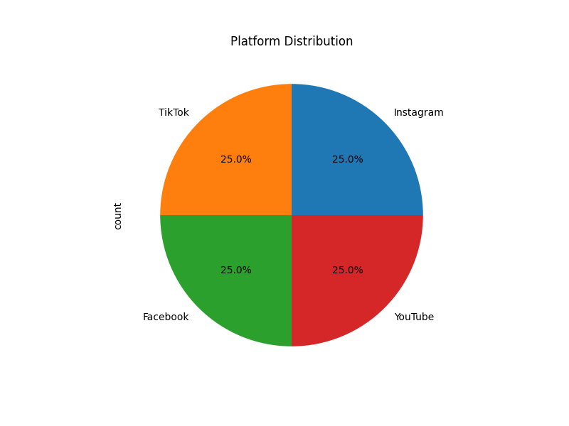

# Data Analyst Test Task

## Executive Summary

The exploratory data analysis (EDA) I performed on the provided social media dataset has yielded several key insights that can help guide further investigation and strategic decision-making. The dataset contains 10,000 records of posts across four major platforms: Instagram, TikTok, Facebook, and YouTube, covering the period from January 1, 2024, to December 5, 2024.

The main findings from my analysis are:

1. **Platform Distribution**: The dataset is evenly distributed across the four platforms, with each accounting for 25% of the total records.
2. **Engagement Metrics Distribution**: The engagement metrics (likes, comments, views) exhibit a wide range, with some posts having significantly higher engagement than others. The majority of posts have relatively low engagement.
3. **Correlation Between Engagement Metrics**: The engagement metrics show moderate to strong positive correlations, indicating that posts with high likes tend to also have high comments and views.
4. **Temporal Trends**: The daily number of posts shows significant fluctuations over time, with a notable peak between March and April.
5. **Platform Differences**: While the platform distribution is even, the total engagement (sum of likes, comments, views) varies significantly between platforms, with YouTube having the highest total engagement.

These insights provide a solid foundation for understanding the dataset and identifying potential areas for further analysis, such as investigating the factors driving high engagement, analyzing temporal patterns in post volume and engagement, and exploring platform-specific content strategies.

## Data Overview

The dataset contains the following columns:

- `platform`: The social media platform the post was made on (Instagram, TikTok, Facebook, YouTube)
- `account_id`: The unique identifier for the account that made the post
- `id`: The unique identifier for the post
- `created_time`: The timestamp when the post was created
- `text_original`: The original text content of the post
- `text_additional`: Additional text content of the post (sparse data with only 3 non-null values)
- `likes_count`: The number of likes the post received
- `shares_count`: The number of shares the post received (5,000 non-null values)
- `comments_count`: The number of comments the post received
- `views_count`: The number of views the post received (5,621 non-null values)

The dataset has a good balance of platforms, with each accounting for 25% of the total records. However, there are some missing values in the engagement metrics columns, particularly in `shares_count` and `views_count`.

## Exploratory Data Analysis

### Platform Distribution
The platform distribution is even, with each platform accounting for 25% of the total records.

### Engagement Metrics Distribution
The engagement metrics (likes, comments, views) exhibit a wide range, with some posts having significantly higher engagement than others. The majority of posts have relatively low engagement.

### Correlation Between Engagement Metrics
The engagement metrics show moderate to strong positive correlations, indicating that posts with high likes tend to also have high comments and views.

### Temporal Trends
The daily number of posts shows significant fluctuations over time, with a notable peak between March and April

### Platform Differences
While the platform distribution is even, the total engagement (sum of likes, comments, views) varies significantly between platforms, with YouTube having the highest total engagement.

## Conclusion and Recommendations

The exploratory data analysis has provided valuable insights into the dataset, highlighting both the opportunities and challenges that the Trementum Research team may face when working with this data. The key findings suggest potential areas for further investigation, such as:

1. **Drivers of High Engagement**: Analyzing the characteristics of high-engagement posts (e.g., content, timing, platform) to identify factors that contribute to successful social media performance.
2. **Temporal Analysis**: Examining the fluctuations in daily post volume and engagement, particularly the notable peak between March and April, to identify any seasonal patterns or other time-based trends that could inform content planning and optimization.
3. **Platform-specific Strategies**: Exploring the differences in engagement metrics between platforms and identifying the characteristics of high-performing posts on each platform, which could inform platform-specific content strategies.

To build on these insights, the next steps could include:

- Conducting a more detailed analysis of the post content (e.g., sentiment analysis, topic modeling) to understand the types of content that resonate with the audience.
- Investigating the user and account characteristics (e.g., follower count, account age) to see how they relate to post engagement.
- Performing a segmentation analysis to identify groups of posts or accounts with similar engagement patterns, which could inform targeted content and outreach strategies.

This report represents approximately 3 hours of work to complete the exploratory data analysis and provide the key insights and recommendations. I'm happy to discuss these findings in more detail or explore additional areas of investigation as needed.
